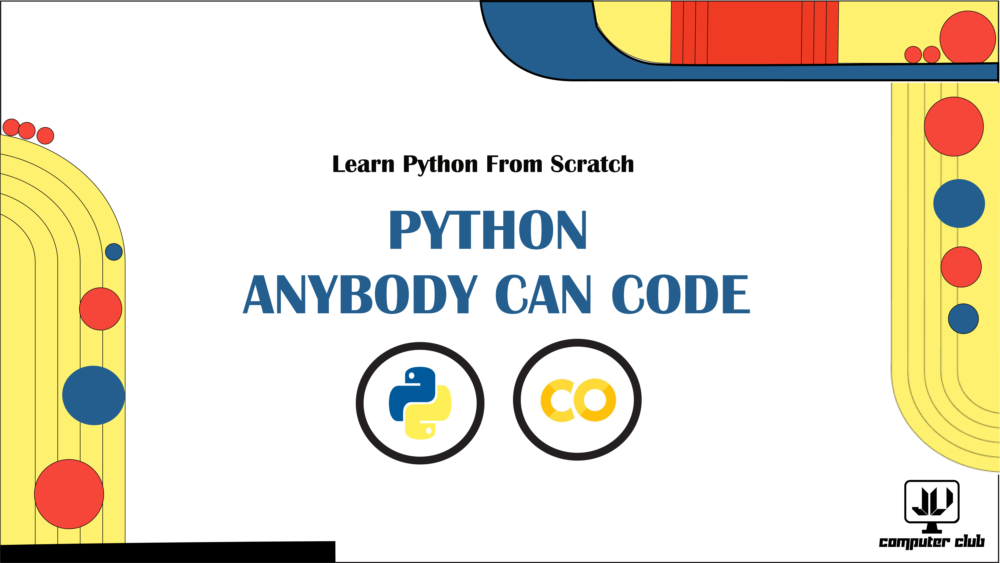

# 🐍 Python - Anybody Can Code 🐍

  

## :speech_balloon: What's Python - Anybody Can Code?

#### **"Python - Anybody Can Code"** is a certification course focused on basic understanding of the Python programming language for newbies. This repository provides supplementary resource materials used for the course.

## :movie_camera: Live Webinar Playlist - [Check On Youtube](https://www.youtube.com/playlist?list=PLn1ftZiUtOkRUvnVNCqzvEvD_d5pT54h3)
  
#### Beginners inquisitive to learn about Python programming will be highly benefitted if [this playlist](https://www.youtube.com/playlist?list=PLn1ftZiUtOkRUvnVNCqzvEvD_d5pT54h3) is followed in order and the tasks and resources are checked and performed accordingly.

## :star: Credits

:arrow_forward: Cover Image Design - [Mansura Kabir](https://github.com/oni201)   
:arrow_forward: Course Instructor 1 - [Faiza Feroz](https://github.com/Faiza27)  
:arrow_forward: Course Instructor 2 - [Rubaiya Reza Sohana](https://github.com/Sohanareza)  
:arrow_forward: Digital Badge - [shields.io](https://shields.io/) 
